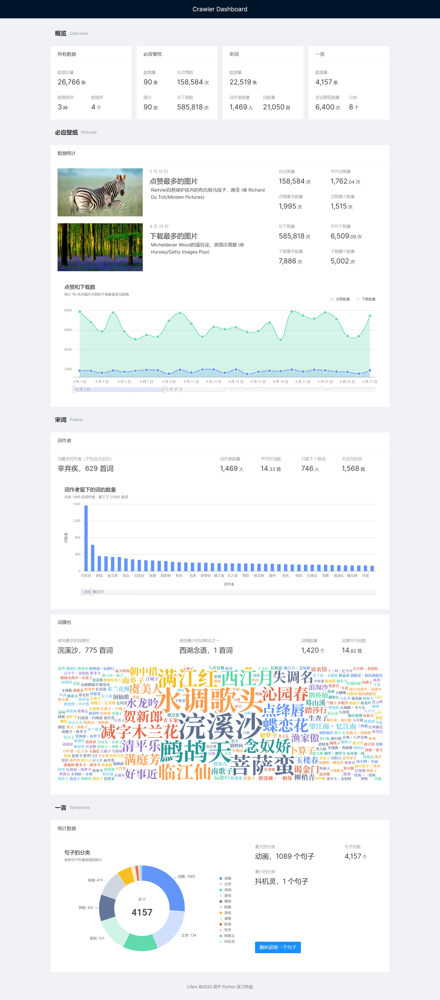
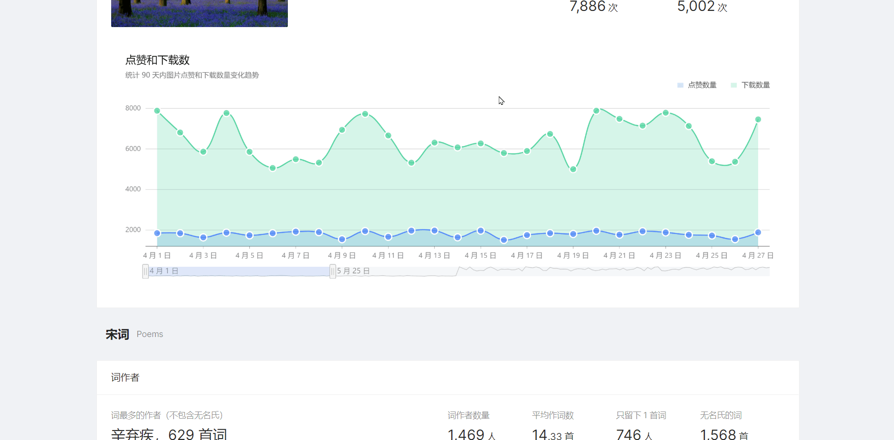
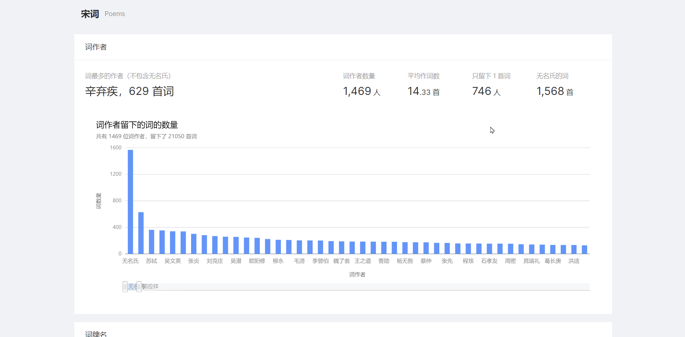
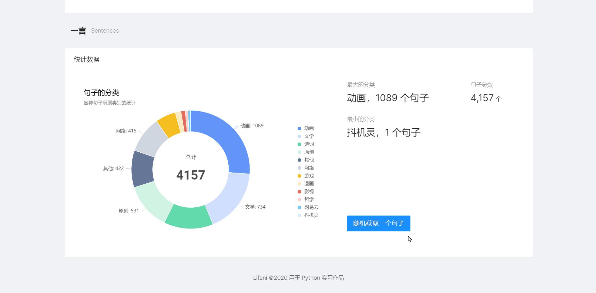

# 爬虫与展示

这是 Python 实习的爬虫项目的一部分，负责数据的展示。

爬取的网站是自己写的：[Lifeni/crawler-test: 用于 Python 爬虫的测试网站](https://github.com/Lifeni/crawler-test) 。

## 技术

- 爬虫部分：使用 Python 的 Scrapy 爬取数据存入 MySQL

- 展示部分：采用前后端分离，Django 作为后端，UmiJS 作为前端

## 截图

